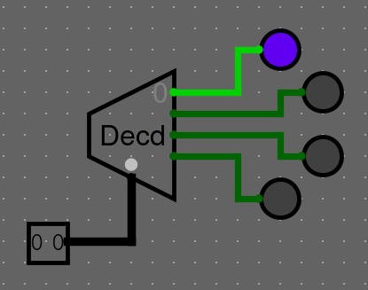
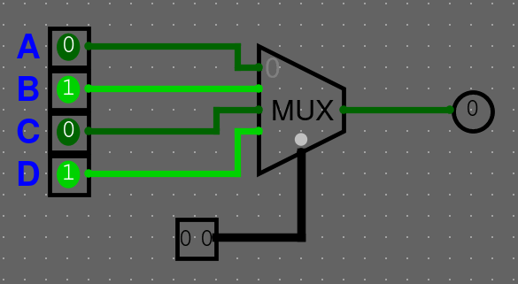
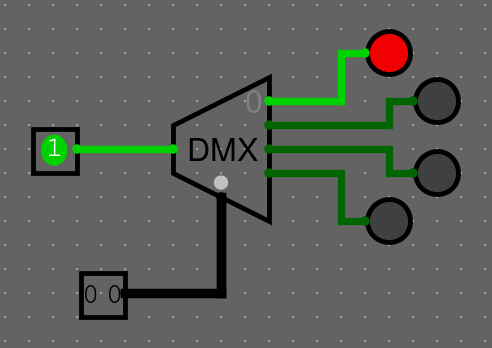

# Multiplexory a dekodéry

### Reprezentace čísel jako binární řetězce

Čísel (zatím kladných, později celých) je nekonečno, a jsou to abstraktní objekty. Aby s nimy šlo pracovat, je potřeba je umět nějak
vyjádřit. My, lidé, na to používáme desitkovou soustavu, zapíšeme např. číslo 137. Počítače pracují pouze s 0 a 1, takže tato reprezentace není vhodná. Je potřeba zvolit nějakou jinou. 

#### Dvojková soustava

Přirozeně se nabízí použít dvojkovou soustavu neboli binární kód. Číslo reprezentujeme jako součet mocnin dvou (namísto 10 v desítkové). Tento
způsob má maximální využití bitů pro přenos informace, tj. pro čísla dané velikosti je nejkratší. Pro reprezentování čísla $2^b-1$ potřebujeme $b$ bitů.


[https://commons.wikimedia.org/wiki/File:Binary_counter.gif](https://commons.wikimedia.org/wiki/File:Binary_counter.gif)


Není to ale jediný způsob, jak pomocí řetězce bitů reprezentovat číslo. S několika dalšími způsoby se ještě setkáme, jakmile začneme
potřebovat umět reprezentovat záporné čísla. Prozatím ale zůstaneme
u čísel kladných.

#### Kód "1 z N" (one-hot coding)

Kód 1 z N spočívá v zakódování čísla $n$ o z rozsahu $\left[ 0, N-1 \right]$ jako řetězec $N$ bitů, kde všechny bity jsou $0$, pouze jediný $n$-tý bit je $1$:

$9_{10} = 1001_2 = 0000000001000000_{1 of 16}$

Tento kód je velmi neefektivní z hlediska potřebného počtu bitů, takže v tomto kódu asi nebude nic nikam posílat, ale je velmi užitečný lokálně v obvodech, protože každý bit kódu přesně vyjadřuje, jestli se jedná o dané číslo. Zároveň máme garantované, že pokud je jeden z bitů $1$, všechny ostatní *musí* být $0$ (jinak by se nejednalo o validní hodnotu v kódu 1 z N). Taková sada bitů se velmi hodí na rozhodování typu "switch":

- Pokud byla v paměti tato instrukce, udělej tohle (pro všechny možné instrukce)
- Na vstupu je ID početní operace. Proveď danou operaci.
- Pokud na vstupu byly tyto 4 hodnoty, udělej tohle, jinak udělej něco jiného (bity lze ORnout)

### Dekodér

Dekodér má $2^n$ výstupů a $n$ bitový vstup (*selector*). Provádí převod z $n$-bitového binárního čísla do kódu 1 z $2^n$, tedy říká v jednoduše zpracovatelné podobě *které číslo* má na vstupu.



Dekodér může mít ještě vstup ENA (enable). Pokud existuje, a je na jeho vstup přivedena $0$, dekodér má na výstupu samé nuly, což má většinou za efekt vypnutí rozhodovací logiky za ním přiojené (nenastala ani jedna z variant). Generuje pak kód "*až* 1 z N".

```admonish warning
Pokud používáte dekodér s enable v Logisimu, ujistěte se, že máte nastavenou možnost "Disabled output" na "Zero". Druhá možnost "Floating" by generovala třetí stav, který je až na výjimky zakázaný!
```

### Multiplexor

Multiplexor bere $2^n$ vstupů a $n$ bitový vstup selector (`SEL`). Výstup má pouze jeden. Může taky obsahovat enable (`ENA`), který určuje, jestli je součástka zapnutá nebo ne.

```admonish warning
Opět platí, že "Disabled output" musí být až na výjimky nastavený na "Zero".
```

Multiplexor se chová jako "výhybka" nebo "switch statement": Na svůj jediný výstup pošle hodnotu z toho ($n$-tého) vstup, který je vybraný na selector vstupu ($n$). Na komponentě je vyznačený 0. vstup a ostatní jsou ve vzestupném pořadí.



Můžeme si chování multiplexoru shrnout do tabulky

| SEL | Vysílaný vstup |
|:---:|:------------:|
| 00 | A |
| 01 | B |
| 10 | C |
| 11 | D |

Pro větší multiplexory bude tabulka větší.

Multiplexor může mít kromě "rozhodovací" šířky $n$, která určuje počet vstupů, také "datovou" šířku $b$, která určuje velikost sběrnice každého "kanálu" multiplexoru. Multiplexor pak jednoduše přeposílá $b$-bitové hodnoty ze vstupů na výstup.

### Demultiplexor

Demultiplexor se chová obráceně z hlediska vstupů. Má jeden vstup a $2^n$ výstupů.



```admonish warning
Opět je potřeba mít "Disabled output" nastavený na "Zero".
```

```admonish info
Pokud má 1-bitový demultiplexor nastavený "Disabled output" na "Zero", chová se stejně (má stejnou logickou funkci a pravdivostní tabulku) jako *Dekodér s enable*. Datový vstup demultiplexoru pak plní stejnou funkci jako enable u dekodéru.
```

#### Cvičení

```admonish error title="Důležité"
V kombinačních obvodech je až na vyjímky zakázáno používat třetí stav! Každý obvod, pro který by šla vytvořit pravdivostní tabulka, jde postavit ze základních hradel, bez třetího stavu!
```

Vytvořte si vlastní dekodér, který bude mít 2 bitový `SEL` vstup.

```admonish done collapsible=true

```

---

Vytvořte si vlastní multiplexor, který bude mít 2 bitový `SEL` vstup a 1 bitové datové bity, pomocí logických bran.

```admonish done collapsible=true

```
