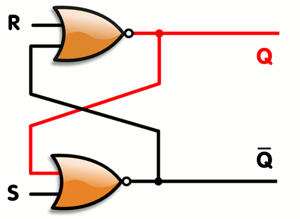

# Paměti - Sekvenční obvody

[Původní verze lekce](https://docs.google.com/document/d/1hbCvrRHl9PXsvyi_1CMGn6c9GZXuJLbwN8DUxsdF6Zg/edit)

{{ todo("Přepsat stránku") }}

[memory_blank.circ](../logisim/memory_blank.circ)

### Kombinační obvody

Kombinační obvody lze ekvivalentně zadefinovat několika způsoby:

- Hodnoty výstupů jsou plně definované pouze hodnotami vstupů
- Obvod implementuje matematickou funkci, tj. lze popsat pravdivostní tabulkou
- V obvodu se nevyskytují žádné cykly (nepřímá závislost vstupu hradla na jeho výstupu)

Příklad kombinačního obvodu

### Sekvenční obvody

Sekvenční obvody jsou ty obvody, které nejsou kombinační, tj. vyskutyjí se v nich nějaké cykly. Tyto cykly způsobují zajímavé chování (paměť), ale jsou obtížnější analyzovat.

Příkladný sekvenční obvod s `OR`

#### Znázornění v pravdivostní tabulce

Protože X je zároveň výstup a vstup do obvodu, musíme tyto dvě jeho funkce rozdělit:

- $X$ - aktuální hodnota vodiče X, tj. vstup
- $X'$ - příští hodnota vodiče X, tj. výstup.

"Příští" tady znamená, jakmile dané hradlo zpracuje své vstupy a aktualizuje svůj výstup - jeho tzv. *propagační delay*, který je vždy nenulový, závislý na výrobním procesu (typická hodnota např. 10ns). Tedy je to hodnota X v budoucnosti.

Nyní v pravdivostní tabulce můžeme popsat, jaké bude *příští X* $X'$ v závislosti na *aktuálním X* $X$ a vstupu $A$:

| A | X | X' |
|:-:|:-:|:--:|
| 0 | 0 | 0  |
| 0 | 1 | 1  |
| 1 | 0 | 1  |
| 1 | 1 | 1  |

Z chování obvodu vidíme, že pokud je $A=0$, $X$ se nezmění ($X'=X$), a pokud $A=1$, pak na $X$ nezáleží a $X'=1$. Můžeme tedy pravdivostní tabulku zjednodušit zavedením *neznámé* $S$:

| A | X | X' |
|:-:|:-:|:--:|
| 0 | S | S  |
| 1 | S | 1  |

V této tabulce může S nabýt libovolných hodnot ($0$ nebo $1$) a každá varianta repreznetuje jeden řádek. Nicméně z takto zjednodušené tabulky je lépe vidět časové chování obvodu:

Pokud se obvod nachází v nějakém "stavu" $S$, tak při $A=0$ v něm **zůstane**, ale při $A=1$ **přejde** do stavu $S=1$.

Zároveň platí, že abychom mohli znát hodnotu výstupu, musíme znát hodnotu aktuálního stavu $S$, který může být skrytý uvnitř obvodu, nestačí nám pouze vstup $A$ - typická vlastnost sekvenčních obvodů.

#### Popis výrazem a nekonečné vyhodnocování

Obvod můžeme popsat i výrazem:

$$ X' = X + A $$

kde $X'$ značí příští hodnotu a $X$ tu stávající. Pokud nám ale vyjde jiné $X'$, než jsem měli $X$, obvod na něj okamžitě zareaguje (je to vstup) a spustí výpočet znovu po dosazení $X'$ za $X$, tedy potenciálně je nutné popsat obvod takto:

$$ X' = (X + A) + A = X + A $$

Zde vidíme, že výraz se po opakovaném (klidně i nekonečném) dosazování $X'$ za $X$ nemění. Z toho lze odvodit, že je garantovaně stabilní. Nemusí tomu tak být vždy

### Nestabilní obvody

Nejjednodušší nestabilní obvod je následující obvod o nula vstupech:

Tento obvod můžeme zase modelovat pomocí výrazu:

$$ X' = \bnot{X} $$

Pokud ale budeme opakovaně dosazovat, nedostaneme ten samý výraz. Označme $X_0$ (neznámý) počáteční stav $X$, a $X_i$ stav po $i$ dosazeních (neboli po $i$ provedeních obvodu). Každý stav se vypočítává z toho předchozího.

$$ X_1 = \bnot{X_0} $$
$$ X_2 = \bnot{X_1} = \bnot{\bnot{X_0}} = X_0 $$
$$ X_3 = \bnot{X_2} = \bnot{X_0} $$
$$ X_4 = \bnot{X_3} = X_0 $$

Můžeme tedy říct, že protože $X_4 \neq X_3$ a obecně $X_{i+1} \neq X_i$, stav obvodu se po každém provedení hradla změní, a tedy není stabilní, nikdy se neustálí na jednu stálou hodnotu, neboli **osciluje**. Skutečně, potvrdí nám to i simulace Logisimem:

### SR Latch

Sekvenční obvody můžete využít pro paměť pomocí hradla `OR`. Hradlo `OR` nám vstup zapne a nechá výstup neustále zapnutý, ale nemáme ho **zatím** jak vyresetovat.

Abychom ho mohli vyresetovat, přidáme další vstup a to `R` jako reset.

Zapíšeme do výrazu

$$ Q = S + B = S + (Q \cdot \overline{R}) $$

Zapíšeme chování do pravdivostní tabulky

| R | S | Q | Q' |
|:-:|:-:|:-:|:--:|
| 0 | 0 | Q | Q |
| 0 | 1 | X | 1 |
| 1 | 0 | X | 0 |
| 1 | 1 | X | 1 |

Vytvořili jsme SR Latch, který se ale dá optimalizovat, tak abychom potřebovali 2 stejné gaty a to `NOR` viz. gif.

### Latch vs Flip Flop

#### Signály

Na následujícím obrázku vidíme 4 definice.

- `High Level` (Active-High) - zde probíhá ukládání
- `Low Level` (Active-Low) - značí se jako `CLK` nebo `ENA`
- `Rising/Falling edge` hodnota se zpracuje v okamžíku přechodu `CLK` signálu z high na low a opačně

#### Latch

Latch je *level-triggered*. To znamená, že latch bere vstup, když je zapnutý viz. obrázek

#### Flip Flop

Flip flop je *edge-triggered*. To znamená, že buď bere vstup na `rising edge` nebo `falling edge`. Na následujícím obrázku bere vstup na `rising edge`.

### Oscillation apparent

V rámci sekvenčních obvodů můžete narazit na chybu `Oscillation apparent`. Znamená to, že jste v nějakém paradoxním cyklu. Vyřešíte to následovně:
- Odstraníme problémový prvek
- `Reset Simulation` (`CTRL+R`)
- Pokud není zapnuté tak --> `Auto-Propagate` (`CTRL+E`) 

### Bonusové materiály

-  Latch vs Flip Flop - [https://www.youtube.com/watch?v=LTtuYeSmJ2g](https://www.youtube.com/watch?v=LTtuYeSmJ2g)
- Latch a Flip Flop na wikipedii
    - Anglicky (víc informací) - [https://en.wikipedia.org/wiki/Flip-flop_(electronics)](https://en.wikipedia.org/wiki/Flip-flop_(electronics))
    - Česky - [https://cs.wikipedia.org/wiki/Bistabiln%C3%AD_klopn%C3%BD_obvod](https://cs.wikipedia.org/wiki/Bistabiln%C3%AD_klopn%C3%BD_obvod)
